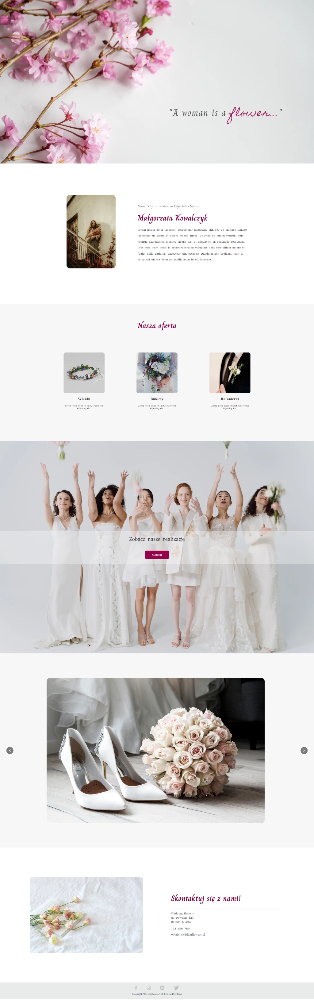

# Landing page - Wedding Flowers
Landing page to present the company's services

## Table of contents
- [General info](#general-info)
- [Technologies](#technologies)
- [Packages used](#packages-used)
- [Website url](#website-url)
- [Website screenshot](#website-screenshots)

## General info
- landing page is built on react components
- consists of 6 sections and a footer
- in section 3, the user can go to other websites to view the company's offer
- button in section 4 scrolls the user to the gallery below
- the gallery was created based on react-multi-carousel
- each page has a footer with links to social media
- lpage is available on desktop and mobile and is a responsive website

## Technologies
Project is created with:
- React.js
- React Router
- TypeScript.js
- SCSS

## Packages used
- react-multi-carousel

## Website url
[Wedding Flowers](https://zealous-tree-0e3f34703.5.azurestaticapps.net/)

## Website screenshot

